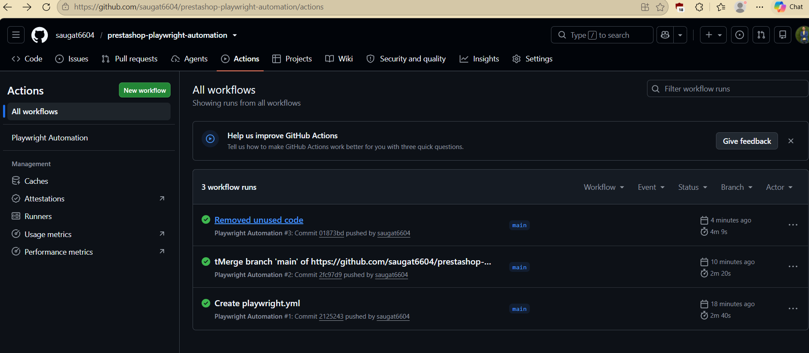
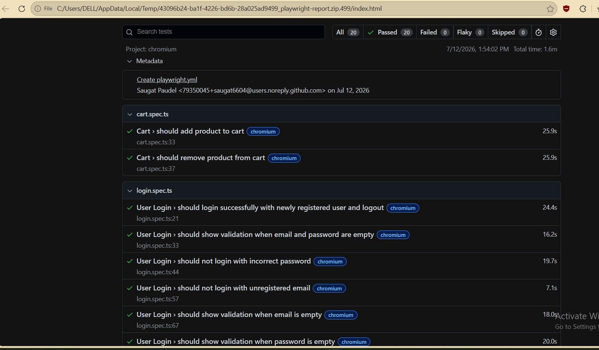
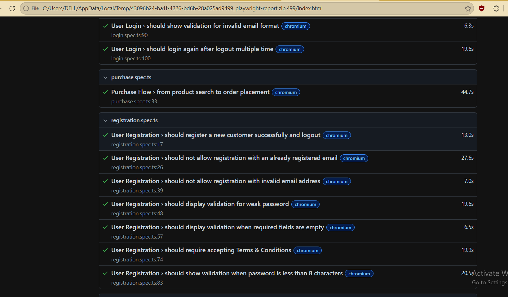
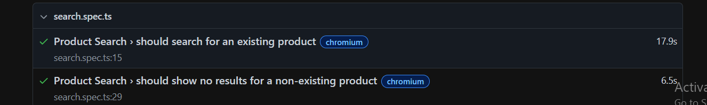

# Playwright Automation Framework - PrestaShop Demo

This project contains an end-to-end automation framework built using **Playwright + TypeScript** following the **Page Object Model (POM)** design pattern.

The framework automates the critical user journeys of the PrestaShop Demo Store including user registration, login, product search, cart management, and checkout.

---

# Tech Stack

- Playwright
- TypeScript
- Faker.js
- Page Object Model (POM)
- Playwright HTML Reporter
- Git & GitHub

---

# Project Structure

```
.
├── pages/
│   ├── HomePage.ts
│   ├── LoginPage.ts
│   ├── RegisterPage.ts
│   ├── ProductPage.ts
│   ├── CartPage.ts
│   ├── CheckoutPage.ts
│   └── OrderSuccessPage.ts
│
├── utils/
│   ├── faker.ts
│   ├── authHelper.ts
│   └── cartHelper.ts
│
├── tests/
│   ├── registration.spec.ts
│   ├── login.spec.ts
│   ├── search.spec.ts
│   ├── cart.spec.ts
│   └── purchase.spec.ts
│
├── playwright.config.ts
├── package.json
└── README.md
```

---

# Folder Explanation

## pages/

Contains all Page Object Model classes.

Each page contains:

- Locators
- Actions
- Assertions

Examples:

- **HomePage.ts** → Homepage actions
- **LoginPage.ts** → Login functionality
- **RegisterPage.ts** → User registration
- **ProductPage.ts** → Product interactions
- **CartPage.ts** → Cart operations
- **CheckoutPage.ts** → Checkout process
- **OrderSuccessPage.ts** → Order confirmation validation

---

## utils/

Contains reusable helper functions.

### faker.ts

Generates dynamic test data using Faker.

### authHelper.ts

Contains reusable authentication methods.

### cartHelper.ts

Contains reusable cart-related utility methods.

---

## tests/

Contains all Playwright test cases.

Current test suites:

- Registration
- Login
- Product Search
- Cart Operations
- Complete Purchase Flow

---

# Test Scenarios

## Registration

- Register a new user with dynamic data
- Validate successful registration

## Login

- Login using registered user
- Validate successful authentication

## Search

- Search existing product
- Search non-existing product

## Cart

- Add product to cart
- Remove product from cart
- Validate empty cart

## Checkout

- Complete purchase flow
- Validate order confirmation

---

# Installation

Clone repository

```bash
git clone <repository-url>
```

Install dependencies

```bash
npm install
```

---

# Running Tests

Run all tests

```bash
npx playwright test
```

Run a specific test

```bash
npx playwright test tests/login.spec.ts
```

Run in headed mode

```bash
npx playwright test --headed
```

Run with one retry

```bash
npx playwright test --retries=1
```

---

# HTML Report

Generate report

```bash
npx playwright show-report
```

---

# Framework Features

- Page Object Model
- Reusable Components
- Dynamic Test Data
- Retry Support
- HTML Reporting
- Easy Maintenance
- TypeScript Support

---

# Screenshots

## Test Result Details






---

# Author

**Saugat Paudel**

QA Engineer | Playwright | TypeScript | API Testing
